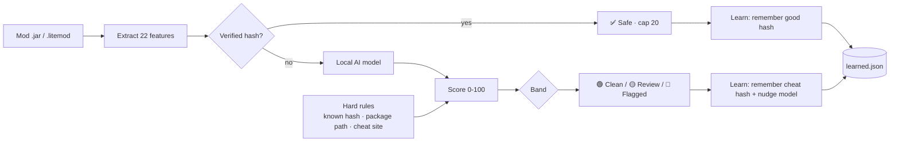

<div align="center">

# 🛡️ AsyncAnalyzer

### Minecraft Mod Forensics + Cheat Detection — powered by a local, self-improving AI

[](#requirements)
[](#requirements)
[-2ecc71)](#-the-ai-model)
[](#-self-improvement)
[](#-proof-it-works)
[](LICENSE)
[](https://github.com/QDHShamiro/AsyncAnalyzer/actions/workflows/benchmark.yml)
[](BENCHMARKS.md)

**Scans your mods for cheat clients (Doomsday, LiquidBounce, Meteor, Vape…), malware and obfuscation — and gives every mod a cheat score with a reason. Verified mods are never flagged. Nothing is ever uploaded.**

</div>

---

## ⚡ Run it (no install, no typing)

```powershell
powershell -ExecutionPolicy Bypass -Command "iex (irm 'https://raw.githubusercontent.com/QDHShamiro/AsyncAnalyzer/main/AsyncAnalyzer.ps1')"
```

**That's it — one command, no questions, no flags.** The tool decides everything itself:

- **What to scan** — every Minecraft instance that is *actually open*, not just one. A
  second running install can't hide behind the first. Extra folders can be added in
  `%APPDATA%\AsyncAnalyzer\paths.txt` (one per line) or team-wide via `scanPaths`.
- **How deep to go** — Minecraft running means someone is being checked right now, so it
  runs the full check. Nothing running means a quick self-check. And if *anything* turns
  up, it goes deeper on its own and says why.
- **Admin** — it asks Windows for elevation once, because deleted-program history (BAM),
  Defender exclusions and scheduled tasks need it. Decline the UAC prompt and the scan
  simply continues without them. `-NoElevate` skips asking.
- **What it could NOT check** — listed with the verdict. A clean result only ever covers
  what was actually checked, and the tool says so instead of implying more.

Nothing waits for a keypress, so the result is written to the HTML report **and** to
`%APPDATA%\AsyncAnalyzer\last-scan.txt`.

### 📄 The report

`%TEMP%\AsyncAnalyzer_Report.html` is the document a staff member reads while the
screenshare is still running, so it is ordered the way that question gets answered:

1. **The verdict**, in words, with the score placed on a scale that draws the real
   band edges (30 / 60 / 85) — so a number is never just an opinion.
2. **What it rests on** — every reason the overall-scan AI used, numbered.
3. **Coverage** — what was checked, and beside it *what could not be checked*. If
   anything is missing and the verdict is clean, that is said right under the
   headline, not buried. A clean result only covers what it lists.
4. **Scan record** — time (local *and* UTC), PC, Windows user, whether it ran as
   admin, whether Minecraft was running, which folders were scanned, report ID.
5. **Every finding** — with the exact paths, hashes, PIDs and memory addresses, plus
   what the check does, why it matters, how it gets there and what to do about it.
6. **The full file inventory**, searchable.

*Copy summary* puts a plain-text version on the clipboard for a ticket or a Discord
thread. Ctrl+P produces a clean black-on-white PDF.

- Want to pick manually or paste a path? Add `-Ask`.

- Know the exact folder? Add `-Path "C:\...\mods"`.
- Want to read the whole script first? Open the raw URL in your browser — it's all there.

---

## ✨ What makes it different

| | |
|---|---|
| 🧠 **Two real AIs, offline** | One model scores every **mod** (22 features), a second scores the **whole scan** (15 signals: mods + system + processes + live JVM memory + deleted-file history). Both run entirely in PowerShell — no cloud, no API key, nothing uploaded. |
| 📈 **Self-improving** | Every scan makes it smarter — it remembers verified & cheat hashes, nudges its own model, and auto-updates from GitHub. |
| ✅ **No false flags** | Verified mods (Modrinth/CurseForge) are **hard-capped as safe**. Anticheats full of `killaura`/`reach` strings are recognised, not flagged. **0 false positives** on 37 real libraries. |
| 🔎 **Explains itself** | Every flag shows the AI probability *and* the exact reasons — package path, obfuscation, signatures, network behaviour. |
| 👻 **Catches ghost clients** | Ghost clients are *injected* into the running game, not dropped in `mods`. If Minecraft is running, the live-memory check turns on by itself (announced openly) — the only way to see an injected client. External clients that run as their own process are caught by name. |
| 🔒 **Trustworthy** | Read-only. Only your mods folder by default. The whole-PC scan is opt-in and asked for separately. |
| 📄 **A report staff can act on** | The HTML report is written for the person running the screenshare: the overall verdict first, then what it rests on, then **what could not be checked**, then every finding with its reasoning and the exact paths, hashes and PIDs behind it. Prints to PDF cleanly, so it can be attached to a ban appeal. |

---

## 🎯 How the verdict works

Instead of *"one bad word = FLAGGED"*, every mod gets a **0–100 score**:

| Band | Score | Meaning |
|:--|:--:|:--|
| ✅ **Verified** | — | Hash matched on Modrinth / CurseForge. **Never flagged.** |
| 🟢 **Clean** | 0–29 | Nothing cheat-like. |
| 🟡 **Review** | 30–59 | Worth a manual look, not confirmed. |
| 🟣 **Server rule** | 30–59 | Recognised for certain — but whether it's *allowed* is your server's rule, not a technical question. Never proof. |
| 🟠 **Likely** | 60–84 | Probably a cheat. |
| 🔴 **Confirmed** | 85–100 | Cheat. |

The score blends the **AI model** with hard rules that always win: a known-cheat hash, a cheat-client package path (`net/ccbluex`, `org/chainlibs`…), or a known cheat download site. Verified / known-good mods are capped safe no matter what.

**Server rule** is its own band because two different things were both landing on "Review",
and a moderator could not tell them apart: *we are not sure what this is* and *we are sure
what this is, and your rulebook decides*. A schematic printer and a mob-radar minimap are the
second kind. It sits in the Review score range and is renamed, never raised — if the same jar
also forges movement packets, that finding stands and it is not a printer any more.

There is also a cap in the other direction. A jar whose bytecode only ever goes through the
game's own systems — reads a keybind, clicks an inventory slot, draws to the screen — and
never forges movement, writes rotation, attacks, loads code or opens a socket, is capped at
Clean. It cannot do what a cheat needs to do, so obfuscated names and alarming strings must
not be allowed to push it into Review on their own. A known-cheat hash or a cheat package
path still overrides the cap.

**A cheat can't hide behind a legit mod.** The mod id (`"id":"sodium"`) lives in the jar's own `fabric.mod.json` — the jar writes it itself, so it proves nothing. A **hash-verified** file really is that mod and stays capped safe; but a jar that merely *claims* a known mod id while carrying injector/cheat evidence is treated as **impersonation → Confirmed**. That covers both a cheat pretending to be Sodium and a real mod someone injected cheat code into (its hash stops matching the moment it's tampered with).

**Nothing slips through as "unknown".** A jar with a random / hash-style filename (like `hb4zz1xxrd4.jar` — exactly how Doomsday and ghost clients ship) that *isn't* verified is floored to **Review** so you always see it, instead of it hiding in an "unknown" pile. A random name **never on its own** makes something a flag — it just gets surfaced for a look. If it *also* has a cheat package path, a cheat download site or a known hash, the hard rules push it to **Confirmed**.



---

## 🧬 It reads what a mod *does*, not what it says

Scraping strings out of a jar loses to any cheat that encrypts them. So the analyser parses
the **constant pool** of each class — the symbol table. To call a Minecraft method you have
to name it there. You can obfuscate your own class names; you cannot obfuscate the API you
call.

That gives behaviour instead of text:

| behaviour | meaning | verdict |
|---|---|---|
| writes a rotation **and** forges its own movement packet | the aim/killaura fingerprint — no legit mod fakes its own movement | 🔴 **Confirmed** |
| decrypts data **then** defines a class from it | loader / dropper | 🔴 **Confirmed** |
| ships Java-agent hooks | can rewrite game code while it runs | 🟠 **Likely** |
| renders **and** sweeps every entity | ESP… **or** a mob-radar minimap | 🟡 **Review**, never an accusation |

That last row is the honest part. **ESP and a mob radar genuinely do the same thing** — the
information that separates them isn't in the bytecode, and no amount of AI recovers it. So
an unverified mod doing it gets surfaced for a human look; a *verified* minimap stays Clean.

**Speed.** Fully parsing every class is not affordable — a 200-mod pack is ~44 000 classes.
But *sampling* is worse than slow, it's wrong: a cheat whose aura module sits at class #150
is invisible to a 40-class sample, and real jars run to a **median of 218 classes**. So every
class gets a cheap native scan and only matches get parsed properly. Detection is
**depth-independent** (pinned by a regression test), and verified mods are skipped entirely
since they're capped safe anyway — so a normal scan only pays for the unverified remainder.

> Measured on 239 samples of real compiled bytecode (77 real Maven libraries as the clean
> side): **precision 1.000, 0 false flags**, recall 0.875 — where every miss is that
> ambiguous ESP/radar class. Full numbers and limits in [`ml/BAKEOFF.md`](ml/BAKEOFF.md).

**Does a bigger AI help?** I tested it properly: logistic regression vs. a neural network
vs. gradient-boosted trees, 5-fold cross-validation. **All three scored identically.** The
behavioural features do the work, not the model — so the simple one ships. Claiming a neural
net here would be marketing, not engineering.

## 🔭 The overall-scan verdict

Single files aren't the whole story — a ghost client can be injected into the running
game, run from a folder outside `mods`, or be deleted right before the screenshare. So
after **every** stage has run (mods, system checks, processes, JVM, deleted-file
history), a second AI (15 signals) scores the **scan as a whole** and prints one clear answer:

```
╔═════════════════════════════════════════════════════════════════════════╗
║  OVERALL SCAN VERDICT (AI, whole scan)                                  ║
║  CLEAN — NOTHING FOUND                                                  ║
║  Score 2/100    AI probability 2%                                       ║
╚═════════════════════════════════════════════════════════════════════════╝
```

### 👻 Injected ghost clients — what it actually tells you

Doomsday and friends inject themselves into the **running game**, so the jar may already
be deleted. When Minecraft is running the live-memory check turns on by itself and reports
three things, not just "something found":

```
◉ INJECTED CHEAT CLIENT: doomsday
    identified live in javaw.exe (PID 8124) at 0x1F4A0000, 37 hit(s). This IS a cheat
    and it is loaded in the running game right now — it is not in the mods folder at all.
◉ Cheat module active in memory: autocrystal
    found in javaw.exe (PID 8124) at 0x1F51C000, 12 hit(s). A cheat feature is live in the game.
```

- **Which hack** — a named client (from the same community list in `signatures.json`, so
  adding a client there teaches the memory scan too) vs. a **module** that tells you what
  it's doing (`autocrystal`, `killaura`, `holefill`…).
- **Where** — process, PID and memory address, plus how many hits (1 hit could be chat
  text; dozens means loaded code).
- **Whether it's a cheat** — a named client in the live heap sets the overall verdict to
  **Confirmed**, because the cheat is running *right now*.
- **Whether it was injected** — the tool also knows every Java package that exists in a jar
  on your disk. If a cheat is live in memory and **no file on disk contains it**, it was
  injected straight into the running game. That's the whole point of a ghost client, and it
  means *deleting files before the check cannot hide it*. That stronger claim is gated: it
  needs a distinctive name **and** repeated hits, so a stray chat message never triggers it.

The sweep walks the game's whole address space rather than a token sample, bounded by a
**time budget** (120 s, or 600 s with `-Deep`) so the cost stays predictable whether the
game took 2 GB or 12 GB.

**Deleted it right before the screenshare?** If `.jar` files ran on this PC and are now
gone **while Minecraft is still open**, the overall verdict goes to at least **Likely** —
the classic wipe-before-the-check pattern. If the game isn't running, the same deletions
stay **Clean**; people update mods all the time.

It weighs the evidence the way a screenshare admin would: a **confirmed cheat jar**,
an **injected JVM** or a **running cheat process** is proof (→ Likely/Confirmed);
**cheat jars stashed outside the mods folder** are worth a look (→ Review); and
"lots of unverified mods" is completely normal and stays **Clean**. Then it *learns
from that scan* — see below.

---

## 🧠 Self-improvement

Detection gets better **every time you use it** — all on your machine, nothing uploaded:

1. **Hash memory** — every verified mod is remembered as *good* (instant + offline next time); every hard-confirmed cheat is remembered as *cheat*.
2. **Online learning** — each confirmed verdict does one bounded SGD step on the model weights (anchored to the base model, so it adapts but can never drift into false positives). Stored in `%APPDATA%\AsyncAnalyzer\learned.json`.
3. **Whole-scan learning** — every *finished scan* also teaches the overall-scan AI, so the tool gets better at reading a **situation**, not just a file. Only unambiguous scans teach it (a hard-confirmed cheat / injected JVM → *cheat*; an all-verified, issue-free scan → *clean*); anything in between teaches it nothing, which is what stops it drifting.
4. **Cloud auto-update** — on start it pulls the newest models + community signature list from this repo, so improvements reach **everyone** (turn off with `-NoUpdate`).

> Proven: after confirming a handful of a *new* cheat family, the model's score for it climbs from **20% → 66%** — while all 37 real clean libraries stay Clean. (`python3 ml/test_selflearn.py`)

**Hybrid sharing:** the community cheat list (`ml/signatures.json`) is downloaded by everyone. Run with `-Share` to export *only* confirmed cheat **hashes** (never files) locally so you can contribute them back.

---

## 🔒 Is it safe? (yes — exactly what it does)

- **Read-only.** Never changes, deletes or quarantines anything.
- **Never uploads your files.** Your mods, documents and personal data stay on your PC.
- **Network = hash lookups only** (Modrinth / CurseForge / Megabase) + fetching the public model. Only a file *hash* is ever sent, never the file.
- Default scan touches **only your mods folder**. Whole-PC scan and live-memory read are **opt-in**.
- **Team mode is off by default.** If a team turns it on (see below), the tool uploads the *scan result* (mod list, hashes, verdict, overall verdict, usernames) to that team's own dashboard — and shows the scanned person a clear notice first. Still never the files themselves.

---

## 👥 Team mode — shared scan history

Running a screenshare / anticheat team? Turn on **team mode** and every scan (yours, Luis's, any staff) lands in **one shared dashboard** — and **the AI itself learns from everyone's scans**, not just each PC. Confirmed detections from all team members train **two** shared models on the backend — one for single mods, one for whole scans — and every client pulls both on the next run. The more your team scans, the smarter it gets for everyone.

<div align="center">

`Staff runs scan` → `result + labelled samples upload` → `one shared model trains on all scans` → `every client pulls the smarter model`

</div>

- Deploy the tiny backend once (**Cloudflare Worker**, free & always-on, or a **zero-dep Node server**) — full steps in [`server/README.md`](server/README.md).
- Flip it on from **`ml/signatures.json`** in your repo (no need to touch the script):
  ```json
  "telemetry": { "enabled": true, "endpoint": "https://…workers.dev", "key": "your-write-secret", "pullSignatures": true }
  ```
- The tool shows the scanned person an **upload notice** (honest by design). Set `"enabled": false` to turn it off for everyone instantly.

The dashboard shows who scanned whom, when, the verdict, and every flagged mod with its reasons — a clean, shareable proof log.

---

## 🚩 Flags

| Flag | Does |
|---|---|
| *(none)* | **Auto-detects** your Minecraft and scans it. Recommended. |
| `-Ask` | Pick the install from a list / paste a path manually. |
| `-Path "C:\…\mods"` | Scan an exact folder. |
| `-SelfTest` | Verify the AI + verdict logic on your machine, then exit. |
| `-Deep` | Analyse **every** class in every jar instead of a sample. Slower, for when you're really investigating someone. |
| `-NoElevate` | Don't ask Windows for Administrator (some checks are then skipped). |
| `-DeepScan` | Also scan drives, recycle bin and processes for cheat traces. |
| `-DeepMemory` | Force the live-memory check on. It already turns on by itself whenever Minecraft is running. |
| `-Share` | Export confirmed cheat hashes locally to contribute them. |
| `-NoUpdate` | Skip the GitHub model/signature auto-update. |
| `-NoLearn` | Don't adapt the local model this run. |
| `-Reset` | Wipe the learned memory and start fresh. |
| `-Yes` | Auto-answer the deep-scan prompt. |
| `-Dev` | Quick developer mode. |

Pass flags with the scriptblock form:
```powershell
powershell -ExecutionPolicy Bypass -Command "& ([scriptblock]::Create((irm 'https://raw.githubusercontent.com/QDHShamiro/AsyncAnalyzer/main/AsyncAnalyzer.ps1'))) -SelfTest"
```

---

## 🤖 The AI model

Trained here, shipped as plain numbers embedded in the script (so it runs with zero dependencies).

```
ml/
├── features.py        # the 22-feature schema (matches the PowerShell extractor)
├── build_dataset.py   # downloads REAL clean libraries + builds labelled data
├── train_model.py     # trains the model, exports weights + metrics
├── online_learn.py    # the self-improvement SGD step (matches the .ps1)
├── verdict.py         # reference port of the verdict logic
├── signatures.json    # community cheat list (auto-downloaded by the tool)
├── session_model.py   # the overall-scan model (source of truth for its weights)
├── session_model.json # overall-scan weights the .ps1 embeds + auto-updates from
├── test_session.py    # proves the overall-scan AI scores + learns correctly
├── model.json         # trained weights + version + metrics
├── test_verdict.py    # end-to-end tests (cheats, clean, anticheat, verified)
├── test_selflearn.py  # proves self-learning helps without false positives
└── test_report.py     # static checks on the screenshare report (thresholds, honesty, encoding)
```

Retrain anytime:
```bash
cd ml && python3 build_dataset.py && python3 train_model.py
```

The **negative class is trained on real libraries** — ASM, ByteBuddy, Javassist, Gson, Netty, Kotlin, log4j, Night-Config… exactly the "scary but legit" code naive scanners false-flag. That's *why* reflection and bytecode manipulation on their own no longer trigger a flag.

---

## 📊 Benchmarks — measured, public, and rerun on every push

Detection is **measured continuously**, not claimed once. [`BENCHMARKS.md`](BENCHMARKS.md)
and the [**benchmark page**](https://qdhshamiro.github.io/AsyncAnalyzer/benchmarks.html) are
generated by `python3 ml/benchmark.py` and refreshed by CI on every push, so the numbers in
this repo are never hand-typed.

The whole site — [overview](https://qdhshamiro.github.io/AsyncAnalyzer/),
[benchmarks](https://qdhshamiro.github.io/AsyncAnalyzer/benchmarks.html) and
[how it works](https://qdhshamiro.github.io/AsyncAnalyzer/how-it-works.html) — is generated
by `python3 ml/site.py` and deployed straight from this repo by GitHub Actions. The rule
documentation is **read out of the shipped script when the page is built**, so it cannot
describe a rule the tool no longer runs.

| | |
|---|---|
| **False flags on real software** | **0** of **177** real Maven Central libraries — through the *full* verdict chain, not just one rule |
| Aim / killaura / pathing / timer | detected, independent of where it hides (class 0 → 4995 of 5000) |
| Combat, movement, world, ghost utilities | **198 of 222** reconstructed cheat variants caught &mdash; scaffold, no-fall, blink, speed, nuker, inventory-move, velocity, triggerbot, autoclicker, freecam, Baritone-style pathing |
| Dropper (decrypt → defineClass) | detected |
| Legit auto-walk vs. pathing cheat | told apart — the cheat forges its own movement packet, the mod uses the game's input |
| Team learning | a new cheat pattern climbs 13% → 35% while clean scans stay at 9% |
| Cost | ~0.35 ms per class; verified mods are skipped entirely |

The build **fails** if a real library is ever flagged by a cheat rule. That gate exists
because this failure mode is silent — a detector that starts flagging legitimate mods looks
fine right up until someone gets accused.

Two results are reported honestly rather than tuned away:

- **11 libraries match the Java-agent rule** — AspectJ, ByteBuddy, OpenTelemetry, Spring
  Instrument, Mockito… Those matches are *correct*: they really do ship instrumentation.
  The rule is scoped to *a jar in a mods folder*, where an agent is abnormal.
- **ESP is not decidable from bytecode.** ESP and a mob-radar minimap do the same thing, so
  it is surfaced for review instead of accused. That costs recall on purpose.
- **A HTTP config pull with reflection is not detectable.** That rule would have matched 87
  of the 177 real libraries, so it does not ship. A ghost client that keeps its modules on a
  server and pulls them at runtime is caught by what it then *does*, not by the download.

Reproduce it yourself from a clean checkout:
```bash
python3 ml/fetch_jars.py && python3 ml/benchmark.py
```

## ✅ Proof it works

| Test | Result |
|---|---|
| `ml/train_model.py` | precision **1.00**, recall **1.00**; worst real-library cheat score **0.13** |
| `ml/test_verdict.py` | **192/192** — cheats caught, real libs Clean, anticheats Clean, impersonation closed |
| `ml/test_selflearn.py` | learns a new family 20 → 66% while keeping every clean file safe |
| `ml/test_session.py` | **27/27** — overall-scan AI: clean scans stay Clean, learns a new *whole-scan* pattern 13 → 30% without drifting |
| federated (live backend) | overall-scan model learned 13 → 39% across 30 scans from 3 team members; clean + hard-confirmed unchanged |
| `-SelfTest` (in-tool) | 58 known cases — mod-level, impersonation, whole-scan **and the report itself** (it renders end to end and is checked, so the document staff read is never the untested part) |
| `ml/test_report.py` | **46/46** — the score scale draws the engine's real band edges, a clean verdict never claims proof, an incomplete scan says so, no template variable is silently undefined |

---

## 🤝 Contributing cheat intelligence

`ml/signatures.json` is a community cheat database the tool auto-downloads every run. Found a cheat it missed? Add one of these (or open an issue) and **everyone's** tool picks it up on the next run:

- `knownCheatHashes` — a confirmed cheat **SHA1** → instant 100% detection.
- `packagePaths` — a distinctive cheat-client Java package (e.g. `org/chainlibs`, `net/wurstclient`) → legit mods never ship these.
- `clientTokens` — a distinctive client filename token (keep it **compound**, e.g. `ghostclient`, never a bare word like `ghost`, so legit mods aren't false-flagged).
- `downloadDomains` — a cheat download site (`{ "match": "doomsdayclient", "name": "DoomsdayClient" }`); a jar downloaded from there is flagged by its `Zone.Identifier`.

---

## 📋 Requirements

- Windows 10 / 11 · PowerShell 5.1+
- Run as Administrator for the full deep scan (BAM history)
- Python 3 only if you want to retrain the model

---

<div align="center">

Made by [**QDHShamiro**](https://github.com/QDHShamiro) · [discord.gg/asyncstudios](https://discord.gg/asyncstudios)

</div>
