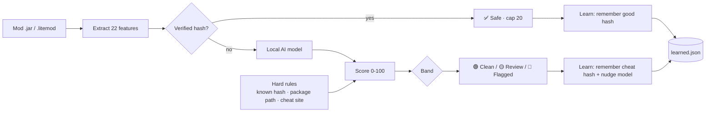

<div align="center">

# 🛡️ AsyncAnalyzer

### Minecraft Mod Forensics + Cheat Detection — powered by a local, self-improving AI

[](#requirements)
[](#requirements)
[-2ecc71)](#-the-ai-model)
[](#-self-improvement)
[](#-proof-it-works)
[](LICENSE)

**Scans your mods for cheat clients (Doomsday, LiquidBounce, Meteor, Vape…), malware and obfuscation — and gives every mod a cheat score with a reason. Verified mods are never flagged. Nothing is ever uploaded.**

</div>

---

## ⚡ Run it (no install)

```powershell
powershell -ExecutionPolicy Bypass -Command "iex (irm 'https://raw.githubusercontent.com/QDHShamiro/AsyncAnalyzer/main/AsyncAnalyzer.ps1')"
```

Type `auto` to auto-detect your mods folder, or press **Enter** for `.minecraft\mods`.
Want to read the whole script first? Open the raw URL in your browser — it's all there.

---

## ✨ What makes it different

| | |
|---|---|
| 🧠 **Real AI, offline** | A trained logistic-regression model (22 features) runs entirely in PowerShell. No cloud, no API key, nothing uploaded. |
| 📈 **Self-improving** | Every scan makes it smarter — it remembers verified & cheat hashes, nudges its own model, and auto-updates from GitHub. |
| ✅ **No false flags** | Verified mods (Modrinth/CurseForge) are **hard-capped as safe**. Anticheats full of `killaura`/`reach` strings are recognised, not flagged. **0 false positives** on 37 real libraries. |
| 🔎 **Explains itself** | Every flag shows the AI probability *and* the exact reasons — package path, obfuscation, signatures, network behaviour. |
| 🔒 **Trustworthy** | Read-only. Only your mods folder by default. Live-memory & whole-PC scans are opt-in. |
| 🎨 **Beautiful report** | A dark-mode HTML report with score bars, badges and reasons — shareable as *"proof I don't cheat."* |

---

## 🎯 How the verdict works

Instead of *"one bad word = FLAGGED"*, every mod gets a **0–100 score**:

| Band | Score | Meaning |
|:--|:--:|:--|
| ✅ **Verified** | — | Hash matched on Modrinth / CurseForge. **Never flagged.** |
| 🟢 **Clean** | 0–29 | Nothing cheat-like. |
| 🟡 **Review** | 30–59 | Worth a manual look, not confirmed. |
| 🟠 **Likely** | 60–84 | Probably a cheat. |
| 🔴 **Confirmed** | 85–100 | Cheat. |

The score blends the **AI model** with hard rules that always win: a known-cheat hash, a cheat-client package path (`net/ccbluex`, `org/chainlibs`…), or a known cheat download site. Verified / known-good mods are capped safe no matter what.



---

## 🧠 Self-improvement

Detection gets better **every time you use it** — all on your machine, nothing uploaded:

1. **Hash memory** — every verified mod is remembered as *good* (instant + offline next time); every hard-confirmed cheat is remembered as *cheat*.
2. **Online learning** — each confirmed verdict does one bounded SGD step on the model weights (anchored to the base model, so it adapts but can never drift into false positives). Stored in `%APPDATA%\AsyncAnalyzer\learned.json`.
3. **Cloud auto-update** — on start it pulls the newest model + community signature list from this repo, so improvements reach **everyone** (turn off with `-NoUpdate`).

> Proven: after confirming a handful of a *new* cheat family, the model's score for it climbs from **20% → 66%** — while all 37 real clean libraries stay Clean. (`python3 ml/test_selflearn.py`)

**Hybrid sharing:** the community cheat list (`ml/signatures.json`) is downloaded by everyone. Run with `-Share` to export *only* confirmed cheat **hashes** (never files) locally so you can contribute them back.

---

## 🔒 Is it safe? (yes — exactly what it does)

- **Read-only.** Never changes, deletes or quarantines anything.
- **Runs on your PC.** Never uploads your files or data.
- **Network = hash lookups only** (Modrinth / CurseForge / Megabase) + fetching the public model. Only a file *hash* is ever sent, never the file.
- Default scan touches **only your mods folder**. Whole-PC scan and live-memory read are **opt-in**.

---

## 🚩 Flags

| Flag | Does |
|---|---|
| *(none)* | Fast, **mods-folder-only** scan. Recommended. |
| `-SelfTest` | Verify the AI + verdict logic on your machine, then exit. |
| `-DeepScan` | Also scan drives, recycle bin and processes for cheat traces. |
| `-DeepMemory` | Also read live Minecraft memory for loaded cheats. |
| `-Share` | Export confirmed cheat hashes locally to contribute them. |
| `-NoUpdate` | Skip the GitHub model/signature auto-update. |
| `-NoLearn` | Don't adapt the local model this run. |
| `-Reset` | Wipe the learned memory and start fresh. |
| `-Yes` | Auto-answer the deep-scan prompt. |
| `-Dev` | Quick developer mode. |

Pass flags with the scriptblock form:
```powershell
powershell -ExecutionPolicy Bypass -Command "& ([scriptblock]::Create((irm 'https://raw.githubusercontent.com/QDHShamiro/AsyncAnalyzer/main/AsyncAnalyzer.ps1'))) -SelfTest"
```

---

## 🤖 The AI model

Trained here, shipped as plain numbers embedded in the script (so it runs with zero dependencies).

```
ml/
├── features.py        # the 22-feature schema (matches the PowerShell extractor)
├── build_dataset.py   # downloads REAL clean libraries + builds labelled data
├── train_model.py     # trains the model, exports weights + metrics
├── online_learn.py    # the self-improvement SGD step (matches the .ps1)
├── verdict.py         # reference port of the verdict logic
├── signatures.json    # community cheat list (auto-downloaded by the tool)
├── model.json         # trained weights + version + metrics
├── test_verdict.py    # end-to-end tests (cheats, clean, anticheat, verified)
└── test_selflearn.py  # proves self-learning helps without false positives
```

Retrain anytime:
```bash
cd ml && python3 build_dataset.py && python3 train_model.py
```

The **negative class is trained on real libraries** — ASM, ByteBuddy, Javassist, Gson, Netty, Kotlin, log4j, Night-Config… exactly the "scary but legit" code naive scanners false-flag. That's *why* reflection and bytecode manipulation on their own no longer trigger a flag.

---

## ✅ Proof it works

| Test | Result |
|---|---|
| `ml/train_model.py` | precision **1.00**, recall **1.00**; worst real-library cheat score **0.13** |
| `ml/test_verdict.py` | **42/42** — cheats caught, 37 real libs Clean, anticheats Clean |
| `ml/test_selflearn.py` | learns a new family 20 → 66% while keeping every clean file safe |
| `-SelfTest` (in-tool) | 6 known cases (Doomsday, grabber, Sodium, anticheat, verified…) all pass |

---

## 🤝 Contributing cheat intelligence

Found a cheat the tool missed? Add its SHA1 to `ml/signatures.json` → `knownCheatHashes` (or open an issue with the hash). Everyone's tool picks it up on the next run via auto-update.

---

## 📋 Requirements

- Windows 10 / 11 · PowerShell 5.1+
- Run as Administrator for the full deep scan (BAM history)
- Python 3 only if you want to retrain the model

---

<div align="center">

Made by [**QDHShamiro**](https://github.com/QDHShamiro) · [discord.gg/asyncstudios](https://discord.gg/asyncstudios)

</div>
