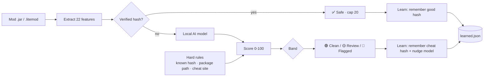

<div align="center">

# 🛡️ AsyncAnalyzer

### Minecraft Mod Forensics + Cheat Detection — powered by a local, self-improving AI

[](#requirements)
[](#requirements)
[-2ecc71)](#-the-ai-model)
[](#-self-improvement)
[](#-proof-it-works)
[](LICENSE)

**Scans your mods for cheat clients (Doomsday, LiquidBounce, Meteor, Vape…), malware and obfuscation — and gives every mod a cheat score with a reason. Verified mods are never flagged. Nothing is ever uploaded.**

</div>

---

## ⚡ Run it (no install, no typing)

```powershell
powershell -ExecutionPolicy Bypass -Command "iex (irm 'https://raw.githubusercontent.com/QDHShamiro/AsyncAnalyzer/main/AsyncAnalyzer.ps1')"
```

**That's it — it finds your Minecraft by itself.** No path to type, no Enter to press. It
auto-detects every install (all launchers + a deep scan of your drives for portable /
renamed installs), picks the right one (the running instance, else the one with the most
mods), and scans it.

- Want to pick manually or paste a path? Add `-Ask`.
- Know the exact folder? Add `-Path "C:\...\mods"`.
- Want to read the whole script first? Open the raw URL in your browser — it's all there.

---

## ✨ What makes it different

| | |
|---|---|
| 🧠 **Two real AIs, offline** | One model scores every **mod** (22 features), a second scores the **whole scan** (12 features: mods + system + processes + JVM + history). Both run entirely in PowerShell — no cloud, no API key, nothing uploaded. |
| 📈 **Self-improving** | Every scan makes it smarter — it remembers verified & cheat hashes, nudges its own model, and auto-updates from GitHub. |
| ✅ **No false flags** | Verified mods (Modrinth/CurseForge) are **hard-capped as safe**. Anticheats full of `killaura`/`reach` strings are recognised, not flagged. **0 false positives** on 37 real libraries. |
| 🔎 **Explains itself** | Every flag shows the AI probability *and* the exact reasons — package path, obfuscation, signatures, network behaviour. |
| 🔒 **Trustworthy** | Read-only. Only your mods folder by default. Live-memory & whole-PC scans are opt-in. |
| 🎨 **Beautiful report** | A dark-mode HTML report with score bars, badges and reasons — shareable as *"proof I don't cheat."* |

---

## 🎯 How the verdict works

Instead of *"one bad word = FLAGGED"*, every mod gets a **0–100 score**:

| Band | Score | Meaning |
|:--|:--:|:--|
| ✅ **Verified** | — | Hash matched on Modrinth / CurseForge. **Never flagged.** |
| 🟢 **Clean** | 0–29 | Nothing cheat-like. |
| 🟡 **Review** | 30–59 | Worth a manual look, not confirmed. |
| 🟠 **Likely** | 60–84 | Probably a cheat. |
| 🔴 **Confirmed** | 85–100 | Cheat. |

The score blends the **AI model** with hard rules that always win: a known-cheat hash, a cheat-client package path (`net/ccbluex`, `org/chainlibs`…), or a known cheat download site. Verified / known-good mods are capped safe no matter what.

**Nothing slips through as "unknown".** A jar with a random / hash-style filename (like `hb4zz1xxrd4.jar` — exactly how Doomsday and ghost clients ship) that *isn't* verified is floored to **Review** so you always see it, instead of it hiding in an "unknown" pile. A random name **never on its own** makes something a flag — it just gets surfaced for a look. If it *also* has a cheat package path, a cheat download site or a known hash, the hard rules push it to **Confirmed**.



---

## 🔭 The overall-scan verdict

Single files aren't the whole story — a ghost client can be injected into the running
game, run from a folder outside `mods`, or be deleted right before the screenshare. So
after **every** stage has run (mods, system checks, processes, JVM, deleted-file
history), a second AI scores the **scan as a whole** and prints one clear answer:

```
╔═════════════════════════════════════════════════════════════════════════╗
║  OVERALL SCAN VERDICT (AI, whole scan)                                  ║
║  CLEAN — NOTHING FOUND                                                  ║
║  Score 2/100    AI probability 2%                                       ║
╚═════════════════════════════════════════════════════════════════════════╝
```

It weighs the evidence the way a screenshare admin would: a **confirmed cheat jar**,
an **injected JVM** or a **running cheat process** is proof (→ Likely/Confirmed);
**cheat jars stashed outside the mods folder** are worth a look (→ Review); and
"lots of unverified mods" is completely normal and stays **Clean**. Then it *learns
from that scan* — see below.

---

## 🧠 Self-improvement

Detection gets better **every time you use it** — all on your machine, nothing uploaded:

1. **Hash memory** — every verified mod is remembered as *good* (instant + offline next time); every hard-confirmed cheat is remembered as *cheat*.
2. **Online learning** — each confirmed verdict does one bounded SGD step on the model weights (anchored to the base model, so it adapts but can never drift into false positives). Stored in `%APPDATA%\AsyncAnalyzer\learned.json`.
3. **Whole-scan learning** — every *finished scan* also teaches the overall-scan AI, so the tool gets better at reading a **situation**, not just a file. Only unambiguous scans teach it (a hard-confirmed cheat / injected JVM → *cheat*; an all-verified, issue-free scan → *clean*); anything in between teaches it nothing, which is what stops it drifting.
4. **Cloud auto-update** — on start it pulls the newest models + community signature list from this repo, so improvements reach **everyone** (turn off with `-NoUpdate`).

> Proven: after confirming a handful of a *new* cheat family, the model's score for it climbs from **20% → 66%** — while all 37 real clean libraries stay Clean. (`python3 ml/test_selflearn.py`)

**Hybrid sharing:** the community cheat list (`ml/signatures.json`) is downloaded by everyone. Run with `-Share` to export *only* confirmed cheat **hashes** (never files) locally so you can contribute them back.

---

## 🔒 Is it safe? (yes — exactly what it does)

- **Read-only.** Never changes, deletes or quarantines anything.
- **Never uploads your files.** Your mods, documents and personal data stay on your PC.
- **Network = hash lookups only** (Modrinth / CurseForge / Megabase) + fetching the public model. Only a file *hash* is ever sent, never the file.
- Default scan touches **only your mods folder**. Whole-PC scan and live-memory read are **opt-in**.
- **Team mode is off by default.** If a team turns it on (see below), the tool uploads the *scan result* (mod list, hashes, verdict, overall verdict, usernames) to that team's own dashboard — and shows the scanned person a clear notice first. Still never the files themselves.

---

## 👥 Team mode — shared scan history

Running a screenshare / anticheat team? Turn on **team mode** and every scan (yours, Luis's, any staff) lands in **one shared dashboard** — and **the AI itself learns from everyone's scans**, not just each PC. Confirmed detections from all team members train **two** shared models on the backend — one for single mods, one for whole scans — and every client pulls both on the next run. The more your team scans, the smarter it gets for everyone.

<div align="center">

`Staff runs scan` → `result + labelled samples upload` → `one shared model trains on all scans` → `every client pulls the smarter model`

</div>

- Deploy the tiny backend once (**Cloudflare Worker**, free & always-on, or a **zero-dep Node server**) — full steps in [`server/README.md`](server/README.md).
- Flip it on from **`ml/signatures.json`** in your repo (no need to touch the script):
  ```json
  "telemetry": { "enabled": true, "endpoint": "https://…workers.dev", "key": "your-write-secret", "pullSignatures": true }
  ```
- The tool shows the scanned person an **upload notice** (honest by design). Set `"enabled": false` to turn it off for everyone instantly.

The dashboard shows who scanned whom, when, the verdict, and every flagged mod with its reasons — a clean, shareable proof log.

---

## 🚩 Flags

| Flag | Does |
|---|---|
| *(none)* | **Auto-detects** your Minecraft and scans it. Recommended. |
| `-Ask` | Pick the install from a list / paste a path manually. |
| `-Path "C:\…\mods"` | Scan an exact folder. |
| `-SelfTest` | Verify the AI + verdict logic on your machine, then exit. |
| `-DeepScan` | Also scan drives, recycle bin and processes for cheat traces. |
| `-DeepMemory` | Also read live Minecraft memory for loaded cheats. |
| `-Share` | Export confirmed cheat hashes locally to contribute them. |
| `-NoUpdate` | Skip the GitHub model/signature auto-update. |
| `-NoLearn` | Don't adapt the local model this run. |
| `-Reset` | Wipe the learned memory and start fresh. |
| `-Yes` | Auto-answer the deep-scan prompt. |
| `-Dev` | Quick developer mode. |

Pass flags with the scriptblock form:
```powershell
powershell -ExecutionPolicy Bypass -Command "& ([scriptblock]::Create((irm 'https://raw.githubusercontent.com/QDHShamiro/AsyncAnalyzer/main/AsyncAnalyzer.ps1'))) -SelfTest"
```

---

## 🤖 The AI model

Trained here, shipped as plain numbers embedded in the script (so it runs with zero dependencies).

```
ml/
├── features.py        # the 22-feature schema (matches the PowerShell extractor)
├── build_dataset.py   # downloads REAL clean libraries + builds labelled data
├── train_model.py     # trains the model, exports weights + metrics
├── online_learn.py    # the self-improvement SGD step (matches the .ps1)
├── verdict.py         # reference port of the verdict logic
├── signatures.json    # community cheat list (auto-downloaded by the tool)
├── session_model.py   # the overall-scan model (source of truth for its weights)
├── session_model.json # overall-scan weights the .ps1 embeds + auto-updates from
├── test_session.py    # proves the overall-scan AI scores + learns correctly
├── model.json         # trained weights + version + metrics
├── test_verdict.py    # end-to-end tests (cheats, clean, anticheat, verified)
└── test_selflearn.py  # proves self-learning helps without false positives
```

Retrain anytime:
```bash
cd ml && python3 build_dataset.py && python3 train_model.py
```

The **negative class is trained on real libraries** — ASM, ByteBuddy, Javassist, Gson, Netty, Kotlin, log4j, Night-Config… exactly the "scary but legit" code naive scanners false-flag. That's *why* reflection and bytecode manipulation on their own no longer trigger a flag.

---

## ✅ Proof it works

| Test | Result |
|---|---|
| `ml/train_model.py` | precision **1.00**, recall **1.00**; worst real-library cheat score **0.13** |
| `ml/test_verdict.py` | **42/42** — cheats caught, 37 real libs Clean, anticheats Clean |
| `ml/test_selflearn.py` | learns a new family 20 → 66% while keeping every clean file safe |
| `ml/test_session.py` | **20/20** — overall-scan AI: clean scans stay Clean, learns a new *whole-scan* pattern 13 → 30% without drifting |
| federated (live backend) | overall-scan model learned 13 → 39% across 30 scans from 3 team members; clean + hard-confirmed unchanged |
| `-SelfTest` (in-tool) | 13 known cases — 8 mod-level + 5 whole-scan — all pass |

---

## 🤝 Contributing cheat intelligence

`ml/signatures.json` is a community cheat database the tool auto-downloads every run. Found a cheat it missed? Add one of these (or open an issue) and **everyone's** tool picks it up on the next run:

- `knownCheatHashes` — a confirmed cheat **SHA1** → instant 100% detection.
- `packagePaths` — a distinctive cheat-client Java package (e.g. `org/chainlibs`, `net/wurstclient`) → legit mods never ship these.
- `clientTokens` — a distinctive client filename token (keep it **compound**, e.g. `ghostclient`, never a bare word like `ghost`, so legit mods aren't false-flagged).
- `downloadDomains` — a cheat download site (`{ "match": "doomsdayclient", "name": "DoomsdayClient" }`); a jar downloaded from there is flagged by its `Zone.Identifier`.

---

## 📋 Requirements

- Windows 10 / 11 · PowerShell 5.1+
- Run as Administrator for the full deep scan (BAM history)
- Python 3 only if you want to retrain the model

---

<div align="center">

Made by [**QDHShamiro**](https://github.com/QDHShamiro) · [discord.gg/asyncstudios](https://discord.gg/asyncstudios)

</div>
